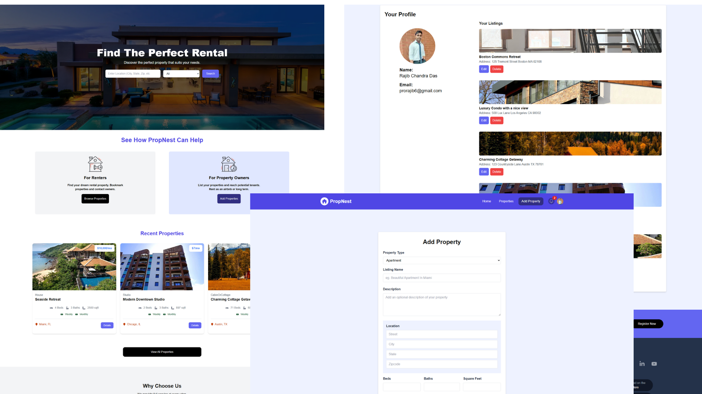

# PropNest

**A Next.js property rental directory application.**

[**Live Demo**](https://propnest.vercel.app/)



---

## Features

PropNest includes the following key features:

- User authentication with Google & NextAuth
- Protected routes and user authorization
- User profile management with personal property listings
- Full CRUD functionality for property listings
- Multiple image uploads for properties (via Cloudinary)
- Property search with dynamic filters
- Internal messaging with unread notifications
- Interactive map integration with Mapbox
- Bookmark and share properties on social media
- Responsive design with Tailwind CSS
- Toast notifications and loading spinners
- Custom 404 error page

---

## Technologies

PropNest leverages the following technologies:

- **Next.js** for server-side rendering and routing
- **React** for building dynamic user interfaces
- **Tailwind CSS** for responsive styling
- **MongoDB** and **Mongoose** for database management
- **NextAuth.js** for secure user authentication
- **Cloudinary** for image storage and management
- **Mapbox** for interactive maps
- **Photoswipe** for image galleries
- **React Toastify** for notifications
- **React Share** for property sharing

---

## Guide to Install on Localhost

### Prerequisites

To run this project locally, ensure you have the following:

- **Node.js** (version 18 or higher)
- A **MongoDB Atlas** cluster ([Sign up](https://www.mongodb.com/))
- A **Cloudinary** account ([Sign up](https://cloudinary.com/))
- A **Google Cloud Console** project ([Get started](https://console.cloud.google.com/))
- A **Mapbox** account ([Sign up](https://www.mapbox.com/))

### Environment Variables

Rename the `env.example` file to `.env` and fill in the required variables:

- **MongoDB URI:** Get your connection string from MongoDB Atlas and add it to `MONGODB_URI`.
- **Google OAuth:** Add your Google Client ID and Secret to `GOOGLE_CLIENT_ID` and `GOOGLE_CLIENT_SECRET`.
- **NextAuth Secret:** Generate one using:
  ```bash
  openssl rand -base64 32
  ```
  Add it to `NEXTAUTH_SECRET`.
- **Cloudinary Config:** Add your Cloudinary Cloud Name, API Key, and API Secret to `CLOUDINARY_CLOUD_NAME`, `CLOUDINARY_API_KEY`, and `CLOUDINARY_API_SECRET`.
- **Mapbox Token:** Add your Mapbox token to `NEXT_PUBLIC_MAPBOX_TOKEN`.
- **Google Geocoding API Key:** Add your API key to `NEXT_PUBLIC_GOOGLE_GEOCODING_API_KEY`.

### Installation

1. Clone the repository:

   ```bash
   git clone https://github.com/your-username/propnest.git
   cd propnest
   ```

2. Install dependencies:

   ```bash
   npm install
   ```

3. Run the development server:

   ```bash
   npm run dev
   ```

4. Open [http://localhost:3000](http://localhost:3000) in your browser to see the application.

---

## License

This project is licensed under the MIT License - see the [LICENSE.md](LICENSE.md) file for details.
